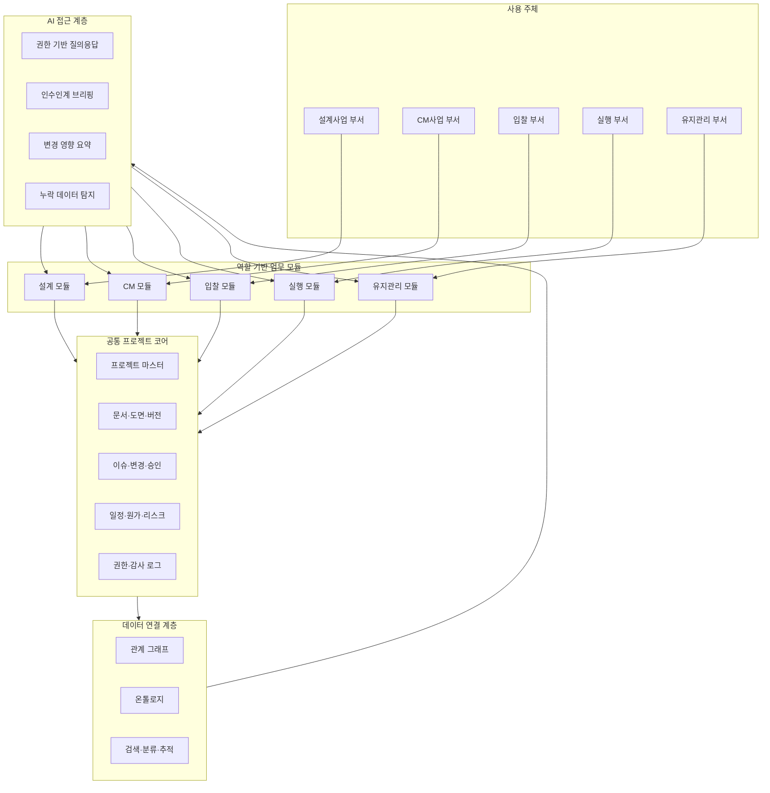
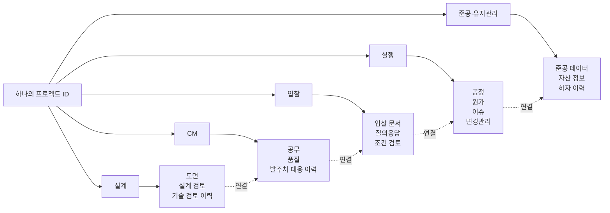
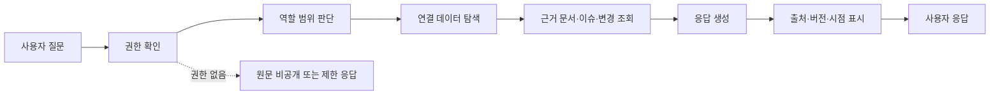

# 건축사업 데이터 플랫폼 시스템 개념도

## 1. 개요

이 문서는 구현 명세서가 아니라, 서비스가 어떤 구조를 가져야 하는지를 설명하는 개념도다. 핵심은 다음 네 층이다.

- 역할 기반 업무 모듈
- 공통 프로젝트 코어
- 데이터 연결 계층
- 보안 통제형 AI 접근 계층

## 2. 전체 시스템 구조

### 해석

- 각 부서는 자신의 역할에 맞는 모듈을 사용한다.
- 모든 모듈은 공통 프로젝트 코어를 공유한다.
- 코어 데이터는 관계 그래프와 온톨로지 구조로 연결된다.
- AI는 이 연결 구조를 바탕으로 필요한 정보만 해석해 제공한다.

## 3. 프로젝트 생애주기 데이터 연속성

### 해석

- 프로젝트는 단계별로 새로 생성되는 것이 아니라 하나의 프로젝트 ID 아래 계속 이어진다.
- 각 단계는 고유한 데이터를 생산하지만, 그 데이터는 이전 단계와의 연결 관계를 유지한다.
- 인수인계는 별도 문서 작성이 아니라 이미 연결된 데이터 구조를 다음 단계에서 이어받는 과정이 된다.

## 4. AI 질의응답 및 보안 흐름

### 해석

- AI는 먼저 사용자의 권한과 역할을 확인한다.
- 이후 연결된 데이터 구조에서 필요한 범위만 탐색한다.
- 답변에는 출처, 버전, 시점이 함께 제시되어야 한다.
- 권한이 없으면 원문 대신 제한된 응답만 제공한다.

## 5. 핵심 구성요소 설명

### 5.1 역할 기반 업무 모듈

부서마다 업무 방식이 다르므로, 화면과 워크플로우는 각기 달라질 수 있다. 이 계층은 현업 수용성을 확보하는 역할을 한다.

### 5.2 공통 프로젝트 코어

모든 부서가 공유해야 하는 프로젝트의 핵심 객체를 관리한다. 플랫폼의 진짜 중심은 이 계층이다.

### 5.3 데이터 연결 계층

문서와 객체를 단순 저장하는 수준을 넘어, 서로의 관계를 해석 가능한 구조로 만든다. 장기적으로 온톨로지와 그래프 기반 확장이 가능한 부분이다.

### 5.4 AI 접근 계층

사용자는 이 계층을 통해 자신의 역할에 필요한 정보만 전달받는다. 원문 전체를 직접 뒤지지 않아도 되지만, 시스템 내부에서는 항상 근거 데이터와 연결되어 있어야 한다.

## 6. 시스템 개념의 핵심 요약

이 시스템은 단일 화면 중심의 통합 솔루션이 아니다. 각 부서가 다른 모듈을 쓰더라도, 모두가 동일한 프로젝트 코어와 연결 구조를 공유하게 만드는 플랫폼이다.

즉, 구조적으로는 다음 문장으로 요약할 수 있다.

> 역할은 분리하되 데이터는 연결하고, 데이터는 보호하되 정보 접근은 AI로 재구성한다.
