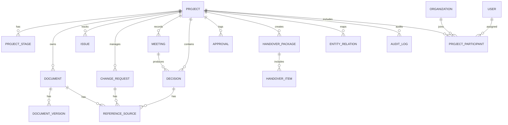

# 건축사업 데이터 플랫폼 데이터모델 초안

## 1. 모델링 원칙

이 플랫폼의 데이터모델은 단순 문서 저장 구조가 아니라, 프로젝트를 구성하는 객체와 관계를 함께 표현하는 구조여야 한다. 이를 위해 다음 원칙을 둔다.

- 모든 핵심 데이터는 프로젝트 맥락 안에 귀속된다.
- 원본을 덮어쓰지 않고 버전으로 관리한다.
- 객체 간 관계를 1급 데이터로 다룬다.
- 권한 정보는 데이터 내용과 별도로 명시적으로 관리한다.
- AI는 허용된 데이터와 관계만 읽을 수 있어야 한다.

## 2. 핵심 엔터티 그룹

### 2.1 프로젝트 마스터 영역

- `project`
- `project_stage`
- `organization`
- `user`
- `project_participant`
- `role`

이 영역은 프로젝트의 기본 식별 정보와 참여 주체를 관리한다.

### 2.2 업무 객체 영역

- `document`
- `document_version`
- `drawing`
- `issue`
- `change_request`
- `meeting`
- `decision`
- `approval`
- `schedule_item`
- `cost_item`
- `risk_item`
- `asset`

이 영역은 실제 프로젝트 수행 과정에서 생성되는 핵심 업무 데이터를 관리한다.

### 2.3 연결 및 추적 영역

- `entity_relation`
- `handover_package`
- `handover_item`
- `audit_log`
- `reference_source`

이 영역은 객체 간 관계, 인수인계 묶음, 추적성과 감사 기능을 담당한다.

### 2.4 접근 제어 영역

- `permission_policy`
- `access_scope`
- `classification_label`

이 영역은 역할, 부서, 보안 등급에 따른 접근 범위를 정의한다.

## 3. 핵심 엔터티 설명

| 엔터티 | 설명 | 예시 핵심 속성 |
|------|------|---------------|
| `project` | 프로젝트의 최상위 단위 | id, code, name, status, owner_org_id |
| `project_stage` | 설계, CM, 입찰, 실행, 유지관리 등 단계 | id, project_id, stage_type, start_at, end_at |
| `document` | 문서의 논리적 원본 단위 | id, project_id, title, doc_type, classification |
| `document_version` | 문서 버전 | id, document_id, version_no, file_uri, created_at |
| `issue` | 해결해야 할 이슈 | id, project_id, issue_type, status, priority |
| `change_request` | 변경 요청 및 검토 단위 | id, project_id, reason, status, requested_by |
| `meeting` | 회의 기록 | id, project_id, meeting_type, held_at |
| `decision` | 회의를 통해 도출된 결정 | id, project_id, decision_type, decided_at |
| `approval` | 승인 또는 결재 기록 | id, project_id, approval_type, status, approved_at |
| `handover_package` | 인수인계 묶음 | id, project_id, from_stage, to_stage, status |
| `entity_relation` | 객체 간 관계 정의 | id, project_id, from_type, from_id, relation_type, to_type, to_id |
| `audit_log` | 행위 이력 기록 | id, actor_id, action_type, target_type, target_id, acted_at |

## 4. 관계 구조의 핵심

이 플랫폼은 관계를 별도 테이블 또는 그래프 구조로 명시해야 한다. 관계를 문서 본문 속 텍스트에만 남기면 AI 활용성과 추적성이 모두 떨어진다.

권장하는 기본 관계 유형은 다음과 같다.

- `references`: 어떤 문서가 다른 문서를 참조함
- `produced_by`: 어떤 산출물이 회의 또는 활동에 의해 생성됨
- `decides`: 어떤 회의가 어떤 결정을 산출함
- `approves`: 어떤 승인 기록이 어떤 변경 또는 문서를 승인함
- `affects`: 어떤 변경이 일정, 원가, 도면, 리스크에 영향을 미침
- `derived_from`: 현재 버전이 어떤 원본 또는 이전 버전에서 파생됨
- `included_in`: 어떤 객체가 인수인계 패키지에 포함됨

## 5. 권장 구조: 관계형 + 그래프 하이브리드

운영 시스템 관점에서는 관계형 데이터베이스가 적합하지만, 객체 간 복합 연결 탐색과 AI 활용 관점에서는 그래프 구조가 유리하다. 따라서 다음과 같은 하이브리드 접근이 적절하다.

- 운영 데이터는 관계형 구조로 저장
- 객체 간 연결은 `entity_relation`으로 명시
- AI 검색과 브리핑을 위해 관계 그래프 형태로 투영 가능하게 설계

즉, 저장은 관계형으로 시작하되 해석은 그래프처럼 할 수 있어야 한다.

## 6. 개념 ER 다이어그램



## 7. 인수인계 중심 데이터 흐름 예시

하나의 인수인계 패키지는 다음과 같은 객체 연결을 가질 수 있다.

```text
프로젝트
 -> 설계 단계 문서
 -> 설계 검토 회의
 -> 회의 결정
 -> 변경 요청
 -> 승인 기록
 -> 미결 이슈
 -> 인수인계 패키지
 -> CM 단계 담당자
```

이 흐름에서 중요한 것은 각 객체가 독립적으로 존재하는 것이 아니라, 서로 연결된 맥락 안에서 함께 전달된다는 점이다.

## 8. AI 활용을 위한 메타데이터

AI가 안전하고 유용하게 작동하려면 각 객체에 다음 메타데이터가 붙어야 한다.

- 소유 조직
- 생성자와 작성 시점
- 문서 유형 및 단계
- 보안 등급
- 공개 가능 범위
- 최신 여부와 유효 기간
- 출처 링크 또는 원문 위치
- 신뢰도 또는 검증 상태

AI 응답은 이 메타데이터를 바탕으로 필터링과 출처 표시를 수행해야 한다.

## 9. 권한 모델 초안

권한은 최소한 다음 세 수준으로 나눌 수 있다.

### 9.1 역할 기반 권한

- 설계 실무자
- CM 실무자
- 부서 책임자
- 관리자

### 9.2 단계 기반 권한

- 설계 단계 접근
- 입찰 단계 접근
- 실행 단계 접근
- 유지관리 단계 접근

### 9.3 보안 등급 기반 권한

- 공개 가능
- 내부 공유
- 제한 공유
- 고보안

최종 접근 가능 범위는 역할, 단계, 보안 등급의 교집합으로 계산하는 방식이 적절하다.

## 10. 데이터모델에서 반드시 지켜야 할 점

- 문서만 저장하고 관계를 저장하지 않는 구조로 가지 않는다.
- 최신본만 남기고 과거 이력을 지우는 방식으로 가지 않는다.
- AI를 위해 별도 비정형 저장소를 만들기 전에 원천 객체 체계를 먼저 정리한다.
- 권한과 보안을 사후 기능으로 붙이지 않는다.

## 11. 향후 확장 방향

장기적으로는 다음 확장이 가능하다.

- 온톨로지 기반 관계 유형 고도화
- 프로젝트 간 유사 이슈 검색
- 변경 영향 자동 추론
- 리스크 예측
- 유지관리 자산 데이터와 운영 시스템 연계

## 12. 결론

이 데이터모델의 핵심은 "문서 저장소"를 만드는 것이 아니라 "프로젝트 맥락 저장소"를 만드는 데 있다. 따라서 가장 중요한 것은 파일을 많이 담는 구조가 아니라, 프로젝트의 객체와 관계, 권한, 이력을 명확히 정의하는 것이다.

한 문장으로 정리하면 다음과 같다.

> 건축사업 데이터 플랫폼의 핵심 데이터는 문서가 아니라, 프로젝트 객체와 그 관계다.
