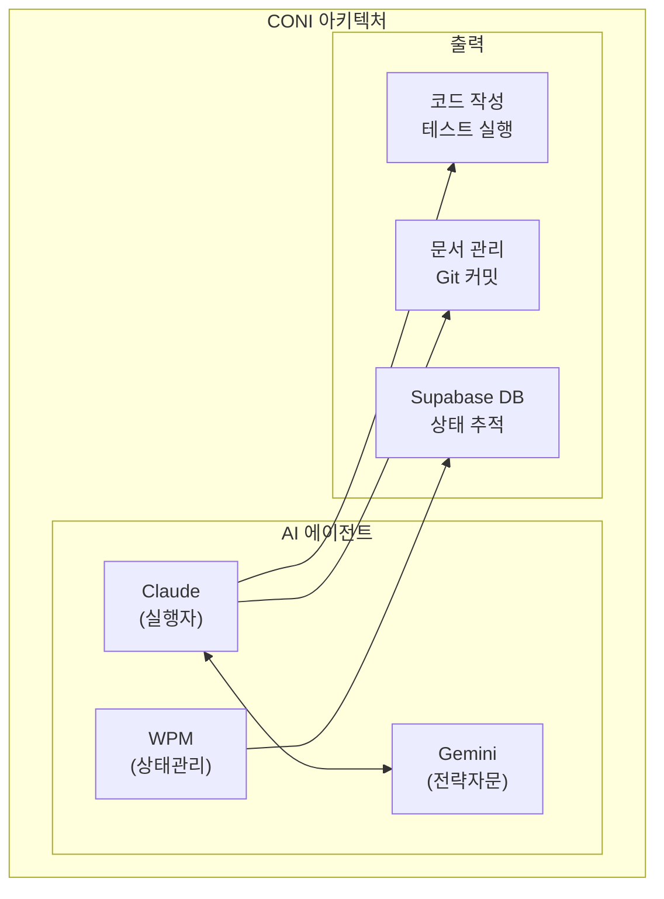
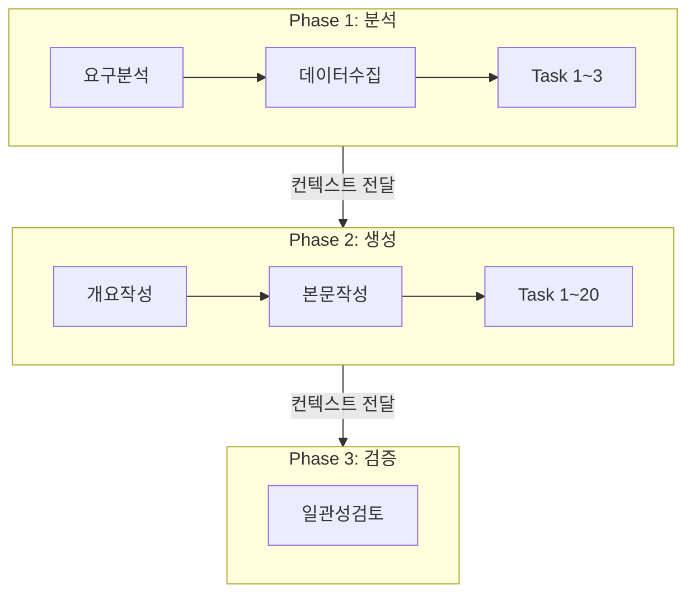
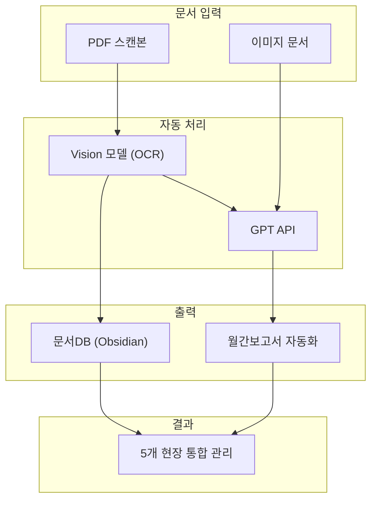
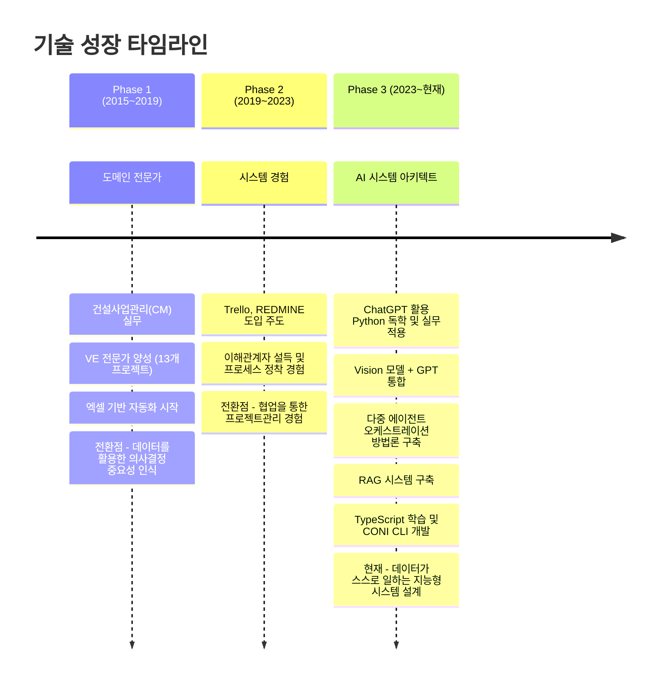

# 기술경력서

## 김성식 | AI 네이티브 시스템 아키텍트

---

# Part 1: 핵심 역량 (Core Competencies)

## 1. 기술 스택 상세

### AI 핵심 기술 (전문)

| 기술 | 숙련도 | 경험 |
|------|--------|------|
| **Multi-Agent Orchestration** | ★★★★★ | 다중 에이전트 협업 시스템 설계 및 구현 |
| **Context Engineering** | ★★★★★ | 대용량 문서 생성 시 일관성 유지 기법 |
| **RAG (Retrieval-Augmented Generation)** | ★★★★☆ | 법령/기준 검색 시스템, 의미 기반 검색 |
| **Vector DB** | ★★★★☆ | Supabase Vector (pgvector), 임베딩 관리 |

### Backend

| 기술 | 숙련도 | 경험 |
|------|--------|------|
| **Python** | ★★★★☆ | 2년, 제안서 에이전트, RAG 시스템 |
| **TypeScript** | ★★★☆☆ | 1개월 집중학습, CONI CLI 도구 개발 |
| **Node.js / Fastify** | ★★★☆☆ | CLI 도구, API 서버 |
| **FastAPI** | ★★★★☆ | 제안서 에이전트 백엔드 |
| **Supabase (PostgreSQL)** | ★★★★☆ | 상태 관리, Vector DB, 마이그레이션 |

### 개발 도구

| 기술 | 숙련도 | 경험 |
|------|--------|------|
| **Git** | ★★★★★ | Hook 자동화, 브랜치 전략 |
| **CLI 개발** | ★★★★☆ | CAC 프레임워크, 사용자 경험 설계 |
| **Obsidian** | ★★★★★ | 지식 관리 시스템, 프로젝트 관리 템플릿 설계 |
| **Vision/OCR** | ★★★★☆ | Apple Vision, Gemini 멀티모달 |

---

## 2. 핵심 전문성 설명

### AI 네이티브 시스템 아키텍처란?

AI 네이티브 시스템 아키텍처는 **AI의 작동 방식을 근본적으로 이해**하고, AI가 최상의 성능을 내도록 **전체 시스템(데이터, 에이전트, 워크플로우)을 설계**하는 접근 방식입니다.

기존 시스템에 AI를 덧붙이는 것이 아니라, 처음부터 AI의 특성을 고려하여:

- **데이터 구조**: AI가 쉽게 이해하고 처리할 수 있는 형태로 설계
- **워크플로우**: AI 에이전트 간 역할 분담과 협업 프로토콜 정의
- **상태 관리**: 대화 세션 간 컨텍스트 유지를 위한 영속적 저장
- **인터페이스**: AI 에이전트가 사용하기 쉬운 CLI/API 설계

### 컨텍스트 엔지니어링 방법론

LLM에 **정확한 맥락을 제공**하여 출력 품질을 극대화하는 기법입니다.

**핵심 기법:**

1. **단계별 분할 (Chunking)**
   - 대용량 작업을 Phase → Stage → Task로 계층적 분할
   - 각 단계마다 명확한 입력과 출력 정의

2. **컨텍스트 누적 (Context Accumulation)**
   - 이전 단계의 결과를 다음 단계로 선별적 전달
   - 전체 문맥을 유지하면서 토큰 제한 관리

3. **프롬프트 최적화**
   - 명확한 지시어, 구체적 예시 제공
   - 출력 형식 명시 (JSON Schema, Markdown 등)

4. **검증 및 재시도**
   - 결과 검증 로직 구현
   - 실패 시 피드백을 통한 자동 재시도

**탄생 배경:**
> 제안서 작성이라는 고차원적 문제를 해결하기 위해 치열하게 고민한 결과, 독자적으로 개발한 이 방법론이 **'컨텍스트 엔지니어링'**과 **'다중 에이전트 오케스트레이션'**이라는 최신 기술의 핵심 원리와 일치한다는 것을 발견했습니다. 이론을 먼저 배운 것이 아니라, **문제를 해결하기 위한 치열한 고민의 결과물이 최신 기술과 맞닿아 있었던 것**입니다.

---

## 3. 주요 프로젝트 상세

### 프로젝트 1: CONI - AI 에이전트 협업 시스템

| 항목 | 내용 |
|------|------|
| **기간** | 2025.11 ~ 현재 (진행 중) |
| **유형** | 개인 프로젝트 (핵심 역량 증명용 프로토타입) |
| **역할** | 기획 및 전체 개발 |

#### Problem

- 전통적인 단일 AI 에이전트 접근 방식의 한계
  - 전략과 실행의 혼재로 깊이 있는 사고와 정확한 실행 사이 균형 상실
  - 대화 세션 종료 시 작업 상태와 진행 내역 유실
  - 여러 작업의 병렬 진행 및 중단/재개 어려움

#### Solution: 역할 기반 분리 + 영속적 상태 추적

#### Tech Stack

| 구분 | 기술 |
|------|------|
| 언어 | TypeScript |
| 런타임 | Node.js 18+ |
| CLI 프레임워크 | CAC |
| DB | Supabase (PostgreSQL) |
| Git 연동 | simple-git, Git Hook |
| 향후 | Vector DB (시스템 맥락 관리) |

#### Outcome

- **Git 커밋 기반 작업 자동 추적 시스템** 구현
  - Git Hook으로 모든 커밋을 work_commits 테이블에 자동 기록
  - 커밋 메시지의 #번호 파싱으로 작업과 자동 연결

- **AI 에이전트 협업 프로토콜** 설계
  - Claude (메인 실행자) ↔ Gemini (전략 자문) 역할 분리
  - 명확한 책임과 권한 정의

- **세션 기반 작업 시간 측정**
  - 로비 세션(탐색) → 작업 세션(구현) → 후속 세션(마무리)
  - Just-in-Time 세션 생성으로 사용자 개입 최소화

- **워크플로우 가이던스 (Guardian 기능)**
  - 6가지 비정상 상태 자동 감지
  - next_steps로 다음 행동 안내

- **다국어 지원 (i18n)**
  - 영어/한국어 지원
  - OS 언어 설정 자동 감지

#### 배운 점

TypeScript를 활용하여 프로덕션 레벨의 CLI 도구 개발에 성공했습니다. Python 학습 경험과 AI 도구를 활용한 빠른 적응 능력 덕분에 1개월 만에 완성도 높은 시스템을 구축할 수 있었습니다. **AI 에이전트가 사용하기 쉬운 인터페이스를 만드는 것**의 중요성을 깨달았습니다.

---

### 프로젝트 2: 제안서 에이전트 (다중 에이전트 오케스트레이션)

| 항목 | 내용 |
|------|------|
| **기간** | 2024.05 ~ 2025.11 (진행 중) |
| **유형** | 회사 프로젝트 (희림종합건축사사무소) |
| **역할** | 기획 및 에이전트 개발 |
| **팀 구성** | 2인 |

#### Problem

- 제안서 작성에 많은 시간과 인력 소요
- 20여 종의 보고서 및 슬라이드 생성 시 앞뒤 내용 불일치
- 여러 AI 에이전트 간 역할 분담 및 협업 어려움
- LLM API 호출 실패 및 네트워크 오류 대응 필요

#### Solution: 계층형 + 이벤트 기반 하이브리드 아키텍처

#### Tech Stack

| 구분 | 기술 |
|------|------|
| 언어 | Python |
| LLM | Google Gemini API |
| 프레임워크 | FastAPI |
| DB | Supabase (PostgreSQL) |
| 아키텍처 | 계층형 + 이벤트 기반 하이브리드 |

#### Outcome

- **한 번의 실행으로 20여 종의 보고서 및 제안서 슬라이드 자동 생성**
  - 프로젝트 개요, 조직도, 수행계획, 기술제안 등 전체 문서 자동화

- **컨텍스트 엔지니어링을 통한 일관성 유지**
  - 단계별 결과를 다음 단계로 누적 전달
  - 전체 문서의 톤앤매너 및 용어 통일

- **계층형 + 이벤트 기반 아키텍처**
  - 26개 API 엔드포인트, 16개 서비스로 구성
  - 높은 확장 가능성과 유지보수성

- **안정성 확보**
  - 지수 백오프 재시도 로직
  - RecoveryService로 중단 지점 복구
  - Health Check 시스템

#### 독자적 방법론의 탄생

문제를 해결하기 위한 치열한 고민 끝에 개발한 접근법이 **'컨텍스트 엔지니어링'**과 **'다중 에이전트 오케스트레이션'**이라는 최신 기술의 핵심 원리와 일치한다는 것을 발견했습니다.

---

### 프로젝트 3: CM 업무관리 시스템

| 항목 | 내용 |
|------|------|
| **기간** | 2023.01 ~ 2024.05 |
| **유형** | 회사 프로젝트 (정림CM, 대전 5개현장 통합건설사업관리) |
| **역할** | 기획 및 개발 (1인) |

#### Problem

- 문서 중심의 비효율적인 CM 업무
- 5개 현장의 방대한 문서 및 데이터 관리 어려움
- 비IT 사용자의 시스템 학습 부담

#### Solution: Obsidian 기반 맞춤형 문서관리 시스템

#### Tech Stack

| 구분 | 기술 |
|------|------|
| 플랫폼 | Obsidian (Markdown 기반 지식 관리 도구) |
| 언어 | Python |
| AI | GPT API (OpenAI), Gemini API (Google) |
| Vision/OCR | 애플 Vision 모델 → Gemini 멀티모달 모델 |
| 자동화 | Python 스크립트 |

#### Outcome

- **5개 현장 통합 문서 중앙 관리**
  - 모든 프로젝트 문서를 단일 시스템에서 관리

- **AI 기반 문서 자동화**
  - OCR + GPT를 통한 문서 자동 등록 및 요약
  - 사업비, 계약 데이터 실시간 대시보드

- **현장 전체의 핵심 협업 시스템으로 정착**
  - 비IT 사용자도 쉽게 사용
  - 월간보고서 자동 생성으로 업무 효율화

#### 배운 점

**AI를 활용한 독학의 힘**을 실감했습니다. ChatGPT를 활용하면서 Python을 빠르게 학습하고 실무에 적용할 수 있었습니다. 비정형 데이터(PDF, 이미지)를 Vision 모델로 구조화하고, LLM으로 의미를 추출하는 **AI 파이프라인 설계 경험**을 쌓았습니다.

---

## 4. 오픈소스 프로젝트

### mlx-serve

| 항목 | 내용 |
|------|------|
| **설명** | Apple Silicon용 MLX 기반 임베딩/리랭킹 서버 |
| **기술** | Python, MLX, FastAPI |
| **배포** | Homebrew (`brew tap menaje/mlx-serve`) |

**주요 기능:**
- OpenAI 호환 API (`/v1/embeddings`)
- Jina 호환 리랭킹 API (`/v1/rerank`)
- Native Metal 가속
- 모델 양자화 (4-bit, 8-bit)
- LRU 캐시 + TTL 기반 모델 관리
- launchd/systemd 서비스 통합

**의의:** 로컬 환경에서 임베딩/리랭킹 서버 운용을 위한 실용적 도구 개발

### supamigrate

| 항목 | 내용 |
|------|------|
| **설명** | Supabase Cloud → Self-hosted 마이그레이션 도구 |
| **기술** | TypeScript, Node.js, PostgreSQL |

**주요 기능:**
- 스키마, 데이터, Functions, Triggers 마이그레이션
- RLS 정책 및 권한(GRANTs) 이전
- Storage (버킷 + 파일) 마이그레이션
- FK 의존성 순서 자동 정렬
- 마이그레이션 후 데이터 검증

**의의:** DB 마이그레이션 전문 지식, Supabase 심층 이해

---

# Part 2: 부록 (Appendix)

## A. 기타 프로젝트

### 희림 사이드 프로젝트 (RAG 시스템)

| 항목 | 내용 |
|------|------|
| **기간** | 2024.05 ~ 2024.12 |
| **역할** | 기획 및 개발 (1인) |

**서브 프로젝트:**

1. **법령 데이터 자동 수집 및 RAG 시스템**
   - 법제처 API를 통한 건설 관련 법령 자동 수집
   - 개정 사항 자동 감지 및 업데이트
   - Vector DB 기반 의미 검색 및 질의응답

2. **건설관련 기준 벡터 DB 기반 검색 시스템**
   - 국가기술표준 API 연동
   - 유사 기준 검색 및 추천

3. **건설기술 자율 지식 생성 시스템**
   - LLM을 활용한 기술 문서 자동 생성
   - 지식 그래프 구축

**Tech Stack:** Python, Supabase Vector (pgvector), 공공데이터 API

### VE 업무 자동화 시스템 (2017~2019)

| 항목 | 내용 |
|------|------|
| **적용** | 13개 VE 프로젝트 |
| **역할** | 기획 및 개발 (1인) |

**핵심 기능:**
- VE 업무 프로세스 표준화 (기능 정의, 대안 생성, 평가)
- 보고서 자동 생성 (표, 그래프, 요약)
- VE 아이디어 및 아이템 데이터베이스 구축

**Tech Stack:** Excel (수식 기반)

**의의:** **"데이터 중심 설계" 철학의 출발점**. 데이터를 체계적으로 관리하고 자동화하면 의사결정의 질도 향상된다는 것을 깨달은 경험.

---

## B. 건설 경력 상세 (IT 도입 중심)

### 1. 대전 5개현장 통합건설사업관리 (2023~2024)

| 항목 | 내용 |
|------|------|
| **발주처** | 대전시청 |
| **역할** | 공무 담당자 (단장 보좌) |

**IT 관련 주요 성과:**
- Obsidian 기반 5개 현장 통합 문서관리 시스템 구축
- GPT API를 활용한 문서 요약 및 업무 가이드 자동화
- Vision 모델을 활용한 문서 자동 등록
- CM 월간보고서 자동 생성

**리더십:**
- 총괄 단장 대리 역할 수행 (위기 상황 대응)
- 5개 현장 시공사, 발주처 이슈 조율 및 의사결정

### 2. 명동N빌딩 리모델링 (2021~2022)

| 항목 | 내용 |
|------|------|
| **발주처** | SK D&D |
| **역할** | 공무 담당자 |

**IT 관련 주요 성과:**
- **Trello를 발주처-시공사-CM 공식 협업툴로 도입**
  - 발주처에 직접 제안하고 설득
  - 이해관계자를 설득하고 새로운 프로세스를 정착시킨 경험
- REDMINE 기반 CM 내부 업무관리 시스템 활용

### 3. 삼일빌딩 리모델링 (2019~2020)

**IT 관련 주요 성과:**
- 엑셀 기반 CM 업무관리 시스템 개발 (공정 및 WBS 업무별 관리)
- REDMINE 시스템 개인 서버 구축 및 운영

### 4. 본사 기술팀 (2017~2019)

**VE 전문가 역할:**
- 13개 VE 프로젝트 퍼실리테이터
- VE 업무 자동화 시스템 개발
- 47개 프로젝트 구조분야 기술지원

---

## C. 기술 성장 곡선

---

## D. 학력 및 자격

### 학력

| 학위 | 학교 | 전공 | 기간 |
|------|------|------|------|
| **석사** | 충북대학교 건축공학과 | 건축구조해석 | 2011.03 ~ 2013.02 |
| **학사** | 충북대학교 건축공학과 | 건축공학 | 2005.03 ~ 2011.02 |

### 자격사항

| 자격명 | 설명 |
|--------|------|
| **건축기사** | 건축 구조 설계 및 검토 |
| **VE 고급과정 이수** | Value Engineering 전문가 |

---

## E. 연락처

| 항목 | 내용 |
|------|------|
| **Email** | dshn21@naver.com |
| **GitHub** | [github.com/menaje](https://github.com/menaje) |
| **LinkedIn** | [linkedin.com/in/성식-김-12b58b224](https://www.linkedin.com/in/성식-김-12b58b224/) |
