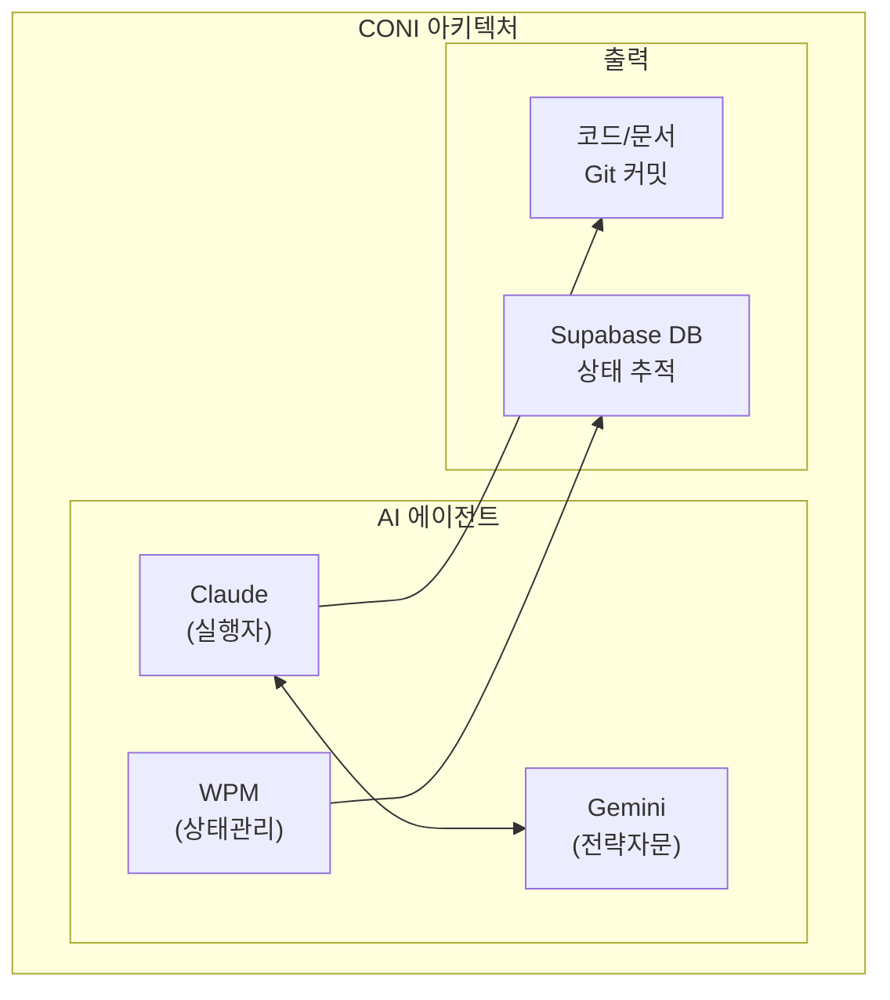
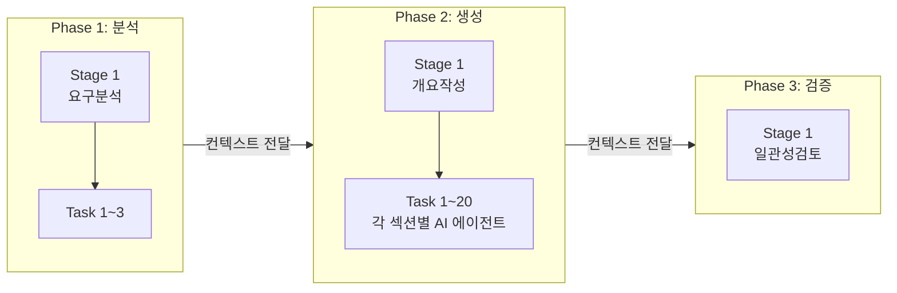
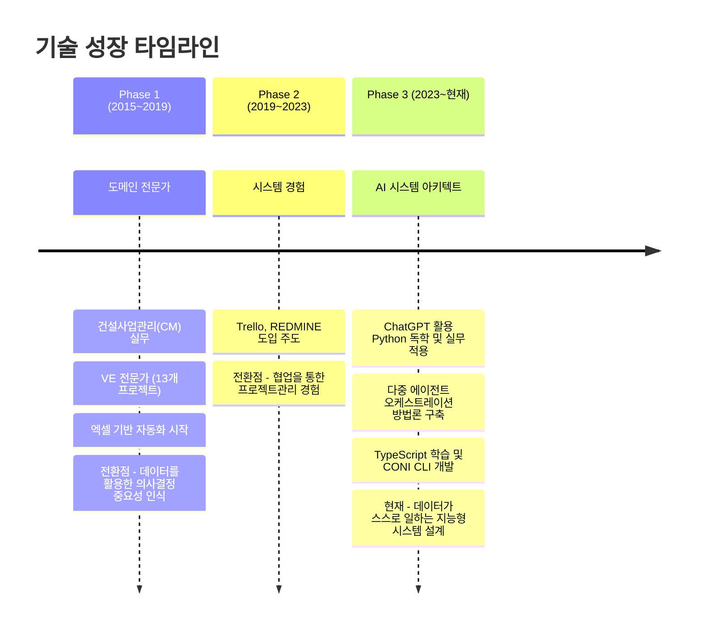

# 김성식 | AI 네이티브 시스템 아키텍트

> "복잡한 현실 세계의 문제를 AI 시스템으로 해결하는 개발자"

---

# Part 1: 이력서

## 인적사항

| 항목 | 내용 |
|------|------|
| **이름** | 김성식 |
| **Email** | dshn21@naver.com |
| **GitHub** | [github.com/menaje](https://github.com/menaje) |
| **LinkedIn** | [linkedin.com/in/성식-김-12b58b224](https://www.linkedin.com/in/성식-김-12b58b224/) |

---

## 핵심 정체성

| 구분 | 내용 |
|------|------|
| **현재 역할** | AI 서비스 기획/개발 (희림종합건축사사무소) |
| **총 경력** | 11년 (복잡계 문제 해결 9년 + AI 시스템 개발 2년) |
| **핵심 가치** | 실제로 동작하고 가치를 창출하는 AI 시스템 설계 |
| **차별화** | 도메인 전문성 + AI 기술의 융합, 현장 검증된 솔루션 |

---

## 핵심 전문성

### 1. LLM 에이전트를 위한 영속적 메모리 및 워크플로우 관리 시스템 설계

AI 에이전트가 작업의 맥락을 유지하고 체계적으로 협업할 수 있도록 **영속적 상태 추적 시스템**을 설계합니다. 대화 세션이 끊겨도 작업 컨텍스트가 유지되며, Git 커밋 기반의 자동 작업 추적과 세션 관리를 통해 AI 에이전트의 생산성을 극대화합니다.

### 2. 복잡한 태스크 자동화를 위한 다중 에이전트 워크플로우 오케스트레이션

여러 AI 에이전트를 조율하여 복잡한 비즈니스 문제를 해결합니다. 계층형 작업 분할(Phase → Stage → Task), 컨텍스트 누적 전달, 역할 기반 에이전트 분리를 통해 **한 번의 실행으로 20여 종의 보고서를 자동 생성**하는 시스템을 구축했습니다.

---

## 기술 스택

| 분류 | 기술 |
|------|------|
| **AI 핵심** | Multi-Agent Orchestration, Context Engineering, RAG, Vector DB |
| **LLM API** | Google Gemini, OpenAI GPT, Anthropic Claude |
| **Backend** | Node.js, Fastify, FastAPI, Supabase (PostgreSQL) |
| **Languages** | Python (2년), TypeScript/JavaScript (1개월 집중학습) |
| **Tools** | Git, CLI 개발, Obsidian, Vision/OCR |

---

## 주요 프로젝트 요약

### 1. CONI - AI 에이전트 협업 시스템 (개인 프로젝트)

Claude와 Gemini AI 에이전트를 조율하는 CLI 기반 협업 시스템. **역할 기반 에이전트 분리**(실행/전략/상태관리)와 **Supabase DB를 통한 영속적 상태 추적**으로 대화 세션이 끊겨도 작업 연속성을 보장합니다.

**Tech**: TypeScript, Node.js, Supabase, Git Hook, CAC (CLI)

### 2. 제안서 에이전트 - 다중 에이전트 오케스트레이션 (회사 프로젝트)

**한 번의 실행으로 20여 종의 보고서 및 제안서 슬라이드를 자동 생성**하는 시스템. 26개 API 엔드포인트, 16개 서비스로 구성. 컨텍스트 엔지니어링을 통해 대용량 문서 생성 시에도 일관성과 전문성을 유지합니다.

**Tech**: Python, FastAPI, Google Gemini API, Supabase

### 3. CM 업무관리 시스템 (회사 프로젝트)

5개 건설 현장 통합 문서관리 시스템. Vision 모델과 GPT를 활용한 **문서 자동 등록 및 요약**, 월간보고서 자동 생성 파이프라인 구축. **현장 전체의 핵심 협업 시스템으로 정착**.

**Tech**: Obsidian, Python, GPT API, Gemini Vision

---

## 경력

| 기간 | 회사 | 역할 | 핵심 성과 |
|------|------|------|----------|
| 2024.05 ~ 현재 | (주)희림종합건축사사무소 | AI 서비스 기획/개발 | 다중 에이전트 오케스트레이션 시스템 구축, RAG 시스템 개발 |
| 2015.03 ~ 2024.05 | (주)정림CM | 건설사업관리(CM) 전문가 | 5개 현장 통합 관리, VE 업무 자동화, 총괄 단장 대리 역할 |

---

## 오픈소스 프로젝트

| 프로젝트 | 설명 |
|---------|------|
| **mlx-serve** | Apple Silicon용 MLX 기반 임베딩/리랭킹 서버. OpenAI 호환 API, Homebrew 배포 |
| **supamigrate** | Supabase Cloud → Self-hosted 마이그레이션 도구. 스키마, 데이터, RLS, Storage 지원 |

---

## 학력 및 자격

| 구분 | 내용 |
|------|------|
| **석사** | 충북대학교 건축공학과 건축구조해석 (2011.03 ~ 2013.02) |
| **학사** | 충북대학교 건축공학과 (2005.03 ~ 2011.02) |
| **자격** | 건축기사, VE 고급과정 이수 |

---

# Part 2: 기술경력서

## 1. 기술 스택 상세

### AI 핵심 기술 (전문)

| 기술 | 숙련도 | 경험 |
|------|--------|------|
| **Multi-Agent Orchestration** | ★★★★★ | 다중 에이전트 협업 시스템 설계 및 구현 |
| **Context Engineering** | ★★★★★ | 대용량 문서 생성 시 일관성 유지 기법 |
| **RAG (Retrieval-Augmented Generation)** | ★★★★☆ | 법령/기준 검색 시스템, 의미 기반 검색 |
| **Vector DB** | ★★★★☆ | Supabase Vector (pgvector), 임베딩 관리 |

### Backend

| 기술 | 숙련도 | 경험 |
|------|--------|------|
| **Python** | ★★★★☆ | 2년, 제안서 에이전트, RAG 시스템 |
| **TypeScript** | ★★★☆☆ | 1개월 집중학습, CONI CLI 도구 개발 |
| **Node.js / Fastify** | ★★★☆☆ | CLI 도구, API 서버 |
| **FastAPI** | ★★★★☆ | 제안서 에이전트 백엔드 |
| **Supabase (PostgreSQL)** | ★★★★☆ | 상태 관리, Vector DB, 마이그레이션 |

### 개발 도구

| 기술 | 숙련도 | 경험 |
|------|--------|------|
| **Git** | ★★★★★ | Hook 자동화, 브랜치 전략 |
| **CLI 개발** | ★★★★☆ | CAC 프레임워크, 사용자 경험 설계 |
| **Obsidian** | ★★★★★ | 지식 관리 시스템, 프로젝트 관리 템플릿 설계 |
| **Vision/OCR** | ★★★★☆ | Apple Vision, Gemini 멀티모달 |

---

## 2. 핵심 전문성 설명

### AI 네이티브 시스템 아키텍처란?

AI 네이티브 시스템 아키텍처는 **AI의 작동 방식을 근본적으로 이해**하고, AI가 최상의 성능을 내도록 **전체 시스템(데이터, 에이전트, 워크플로우)을 설계**하는 접근 방식입니다.

기존 시스템에 AI를 덧붙이는 것이 아니라, 처음부터 AI의 특성을 고려하여:

- **데이터 구조**: AI가 쉽게 이해하고 처리할 수 있는 형태로 설계
- **워크플로우**: AI 에이전트 간 역할 분담과 협업 프로토콜 정의
- **상태 관리**: 대화 세션 간 컨텍스트 유지를 위한 영속적 저장
- **인터페이스**: AI 에이전트가 사용하기 쉬운 CLI/API 설계

### 컨텍스트 엔지니어링 방법론

LLM에 **정확한 맥락을 제공**하여 출력 품질을 극대화하는 기법입니다.

**핵심 기법:**

1. **단계별 분할 (Chunking)**: 대용량 작업을 Phase → Stage → Task로 계층적 분할
2. **컨텍스트 누적 (Context Accumulation)**: 이전 단계의 결과를 다음 단계로 선별적 전달
3. **프롬프트 최적화**: 명확한 지시어, 구체적 예시, 출력 형식 명시
4. **검증 및 재시도**: 결과 검증 로직 구현, 실패 시 피드백을 통한 자동 재시도

**탄생 배경:**
> 제안서 작성이라는 고차원적 문제를 해결하기 위해 치열하게 고민한 결과, 독자적으로 개발한 이 방법론이 **'컨텍스트 엔지니어링'**과 **'다중 에이전트 오케스트레이션'**이라는 최신 기술의 핵심 원리와 일치한다는 것을 발견했습니다.

---

## 3. 주요 프로젝트 상세

### 프로젝트 1: CONI - AI 에이전트 협업 시스템

| 항목 | 내용 |
|------|------|
| **기간** | 2025.11 ~ 현재 (진행 중) |
| **유형** | 개인 프로젝트 (핵심 역량 증명용 프로토타입) |
| **역할** | 기획 및 전체 개발 |

#### Problem

- 전통적인 단일 AI 에이전트 접근 방식의 한계
  - 전략과 실행의 혼재로 깊이 있는 사고와 정확한 실행 사이 균형 상실
  - 대화 세션 종료 시 작업 상태와 진행 내역 유실

#### Solution: 역할 기반 분리 + 영속적 상태 추적

#### Outcome

- **Git 커밋 기반 작업 자동 추적 시스템** 구현
- **AI 에이전트 협업 프로토콜** 설계 (Claude ↔ Gemini)
- **세션 기반 작업 시간 측정** (로비 → 작업 → 후속 세션)
- **워크플로우 가이던스 (Guardian 기능)**: 6가지 비정상 상태 자동 감지
- **다국어 지원 (i18n)**: 영어/한국어

---

### 프로젝트 2: 제안서 에이전트 (다중 에이전트 오케스트레이션)

| 항목 | 내용 |
|------|------|
| **기간** | 2024.05 ~ 2025.11 (진행 중) |
| **유형** | 회사 프로젝트 (희림종합건축사사무소) |
| **역할** | 기획 및 에이전트 개발 |
| **팀 구성** | 2인 |

#### Problem

- 제안서 작성에 많은 시간과 인력 소요
- 20여 종의 보고서 및 슬라이드 생성 시 앞뒤 내용 불일치
- LLM API 호출 실패 및 네트워크 오류 대응 필요

#### Solution: 계층형 + 이벤트 기반 하이브리드 아키텍처

#### Outcome

- **한 번의 실행으로 20여 종의 보고서 및 제안서 슬라이드 자동 생성**
- **컨텍스트 엔지니어링을 통한 일관성 유지**
- **26개 API 엔드포인트, 16개 서비스**로 구성
- **안정성 확보**: 지수 백오프 재시도, RecoveryService, Health Check

---

### 프로젝트 3: CM 업무관리 시스템

| 항목 | 내용 |
|------|------|
| **기간** | 2023.01 ~ 2024.05 |
| **유형** | 회사 프로젝트 (정림CM, 대전 5개현장 통합건설사업관리) |
| **역할** | 기획 및 개발 (1인) |

#### Problem

- 문서 중심의 비효율적인 CM 업무
- 5개 현장의 방대한 문서 및 데이터 관리 어려움
- 비IT 사용자의 시스템 학습 부담

#### Outcome

- **5개 현장 통합 문서 중앙 관리**
- **AI 기반 문서 자동화**: OCR + GPT 문서 자동 등록 및 요약
- **현장 전체의 핵심 협업 시스템으로 정착**

---

## 4. 기술 성장 곡선

---

# Part 3: 자기소개서

## 9년의 질문에 AI로 답을 찾아가는 아키텍트

저는 복잡한 현실의 문제를 해결하기 위해 AI 네이티브 시스템을 설계하고 구현하는 개발자입니다.

---

### 문제의식: 9년간 마주한 본질적 질문

10년간 건설사업관리(CM) 현장에서 일하면서 저는 한 가지 본질적인 문제를 발견했습니다.

**"왜 데이터는 항상 파편화되어 있고, 왜 경험은 개인의 머릿속에만 남는가?"**

수천 장의 문서가 오가는 건설 현장에서, 정작 필요한 정보를 찾기 위해 수십 개의 폴더를 뒤져야 했습니다. 10년 경력의 선배가 가진 노하우는 그가 떠나면 함께 사라졌습니다. 저는 이것이 건설업만의 문제가 아니라, **모든 지식 노동의 근본적인 병목**이라는 것을 깨달았습니다.

이 문제의식이 저를 기술의 세계로 이끌었습니다.

---

### 첫 번째 도전: 현장에서 검증된 시스템

문제를 인식한 후, 저는 기다리지 않고 직접 해결책을 만들기 시작했습니다.

**VE 업무 자동화 (2017)**에서 시작했습니다. 정성적인 VE 평가 데이터를 정량화하고, 사용자가 최소한의 입력만 하면 보고서가 자동으로 생성되는 시스템을 만들었습니다. 이때 깨달은 것이 있습니다:

> "잘 설계된 데이터 흐름은 그 자체로 강력한 솔루션이다."

이 철학은 **CM 업무관리 시스템 (2023)**으로 발전했습니다. 5개 현장의 모든 문서를 Obsidian으로 통합 관리하고, GPT와 Vision 모델을 활용해 문서를 자동으로 분류하고 요약하는 시스템을 구축했습니다. 이 시스템은 **현장 전체의 핵심 협업 도구로 정착**했습니다.

중요한 것은 기술이 아니라 **가치**였습니다. 비IT 직원들도 쉽게 사용할 수 있어야 했고, 실제로 업무 시간을 줄여야 했습니다. 이론이 아닌 현장에서 검증된 시스템을 만드는 것, 그것이 제가 추구하는 개발입니다.

---

### 두 번째 도전: 치열한 고민 끝에 만난 최신 기술

2024년, 저는 더 어려운 문제와 마주했습니다. **제안서 작성 자동화**라는 도전이었습니다.

제안서는 단순한 문서가 아닙니다. 20여 종의 보고서와 슬라이드가 서로 연결되어 하나의 일관된 스토리를 만들어야 합니다.

저는 문제를 해결하기 위해 치열하게 고민했습니다:

1. 전체 작업을 **Phase → Stage → Task**로 계층적으로 분할
2. 각 단계마다 **명확한 입력과 출력** 정의
3. 이전 단계의 결과를 다음 단계의 **컨텍스트로 전달**
4. 여러 AI 에이전트에게 **명확한 역할 부여** 및 협업 조율

이렇게 독자적으로 개발한 방법론이 나중에 알고 보니 **'컨텍스트 엔지니어링'**과 **'다중 에이전트 오케스트레이션'**이라는 최신 기술의 핵심 원리와 일치했습니다.

이론을 먼저 배운 것이 아닙니다. **문제를 해결하기 위한 치열한 고민의 결과물이 최신 기술과 맞닿아 있었던 것**입니다.

결과는 **한 번의 실행으로 20여 종의 보고서와 슬라이드가 자동 생성**되는 시스템이었습니다.

---

### 세 번째 도전: AI가 맥락을 기억하는 시스템

제안서 시스템을 만들면서 또 다른 문제를 발견했습니다.

**"왜 AI와의 대화는 매번 새로 시작해야 하는가?"**

대화 세션이 끊기면 지금까지 논의한 모든 맥락이 사라집니다. 이 문제를 해결하기 위해 **CONI**를 만들었습니다. Claude와 Gemini AI 에이전트가 협업하되, 모든 작업 상태가 데이터베이스에 영속적으로 저장되는 시스템입니다.

- **역할 분리**: Claude는 코드를 쓰고, Gemini는 전략을 세우고, WPM은 상태를 관리
- **영속적 추적**: Git 커밋이 자동으로 작업과 연결되고, 세션이 끊겨도 맥락 유지
- **자연스러운 재개**: "작업 계속해줘"라고 말하면 최근 커밋 기반으로 정확히 파악

TypeScript를 1개월 만에 배워 프로덕션 레벨 CLI를 완성했습니다. 무엇보다 **해결하고 싶은 문제가 명확했기 때문**입니다.

---

### 미래: 함께 만들고 싶은 시스템

저는 **복잡하고 도전적인 IT 분야의 문제를 AI 시스템으로 해결**하고 싶습니다.

9년간 현장에서 배운 것이 있습니다. 어떤 기술도 **데이터와 컨텍스트 없이는 무용지물**입니다. 하지만 데이터가 잘 설계되고, AI가 그 맥락을 이해할 수 있다면, **데이터가 스스로 일하는 지능형 시스템**을 만들 수 있습니다.

저는 그런 시스템을 만들어왔고, 앞으로도 만들어가고 싶습니다.

기술을 위한 기술이 아닌, **실제로 동작하고 가치를 창출하는 AI 시스템**. 이론이 아닌 **현장에서 검증된 솔루션**. 그것이 제가 추구하는 개발이고, 제가 함께하고 싶은 도전입니다.

---

# 연락처

| 항목 | 내용 |
|------|------|
| **Email** | dshn21@naver.com |
| **GitHub** | [github.com/menaje](https://github.com/menaje) |
| **LinkedIn** | [linkedin.com/in/성식-김-12b58b224](https://www.linkedin.com/in/성식-김-12b58b224/) |
